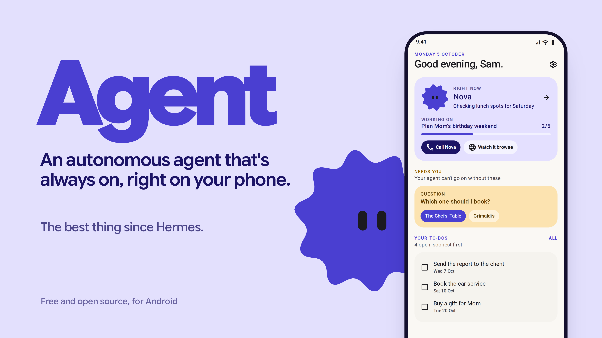

# Agent

One AI agent that lives on your Android phone. You bring the model.



**[Watch the demo videos](https://past-da-king.github.io/agent/)**

Agent is open source and free. It is not a product: there is no account, no server of ours, and nothing to pay. It is aimed at technical people for now.

> **Use it at your own risk.** It is an agent with a browser and access to whatever you connect, and it will make mistakes. Read [Risks](#risks) before you install.

## What it does

- **Background browser.** Its own browser runs in a foreground service, so it keeps working while you use other apps or the screen is off. Captchas and sign-ins are handed to you, then it carries on. Browser profiles keep accounts apart (Personal, Work).
- **Memory as a wiki.** A page per person, place or project, with `[[links]]` between pages and tags on every entry. You can read, edit, pin or delete anything.
- **Tasks and goals.** Your to-dos are kept separate from the agent's own tasks.
- **Routines.** Run on a schedule, on a new email, or on a notification from an app you choose.
- **App connections** through [Composio](https://composio.dev) with your own Composio key: Gmail, Calendar, Drive, Slack and 250+ more.
- **Notifications.** Reads notifications only from the apps you allow, and can pick up one-time codes to finish a sign-in.
- **Voice.** Voice notes, and live voice calls on Gemini Live if you add a Gemini key.
- **Photos and documents** in chat: PDFs (including scans), Word files, text and CSV. Scans are read with on-device OCR (ML Kit).
- **Helper agents** for parallel jobs. Tap one to see what it is doing.
- **Runs code** on the phone, using the bundled Node runtime.
- **Make it yours.** Pick the agent's name, face and colour.
- **Overnight.** At 02:00, only while charging and online, it tidies its memory, writes running notes from the day's chat and prepares a morning screen for you.

Anything that spends money or sends something on your behalf waits until you hold an approve button. Phone permissions are off until the agent needs one.

## Requirements

- Android 10 or newer (API 29+), **arm64** phone.
- About 250 MB for the APK (the Node runtime is bundled), plus room for its data.
- A model: an API key or one of the supported subscriptions (below).

## Install

1. Download the latest APK from [Releases](https://github.com/Past-da-king/agent/releases).
2. Open it on your phone. Android will ask you to allow installs from your browser or files app; allow it for this install.
3. Open Agent. On Samsung, Xiaomi and similar phones, go to **Settings > Apps > Agent > Battery** and set it to **Unrestricted**, or routines and background browsing will be killed.

## Setup

Onboarding walks you through this. In order:

1. **Name and style.** Name your agent, pick a colour and a face. The face becomes the app's icon.
2. **Power.** Choose one:

   | Option | What you need | Notes |
   |---|---|---|
   | API key | A key from DeepSeek, OpenRouter, Gemini, Anthropic, OpenAI or OpenCode Zen/Go | Runs on the app's own Kotlin agent loop. Fastest to set up. |
   | Any OpenAI-compatible endpoint | Base URL, model name, key | Hosted services or your own server. See [Self-hosted servers](#self-hosted-servers-ollama-lm-studio-vllm-strata). |
   | ChatGPT subscription | A ChatGPT account (free worked in testing) | Runs OpenAI Codex on the phone through the bundled runtime. Sign in in-app. |
   | Claude subscription | Claude Pro or Max | Runs Claude Code on the phone through the bundled runtime. **See the Risks section first.** |

   After a key is checked you can pick the model. Switch models any time from the chip at the top of the chat.
3. **Connections (optional).** Paste your Composio API key under **Connections**, then connect the apps you want. The agent can also ask to connect an app when it needs one, and the sign-in opens inside the app's browser.
4. **Voice (optional).** **Settings > Voice**: add a Google/Gemini, OpenAI or ElevenLabs key for spoken voice notes. A Gemini key also turns on live calls.
5. **Notifications (optional).** Choose which apps the agent may read notifications from. Nothing is read until you do.

## Self-hosted servers (Ollama, LM Studio, vLLM, Strata…)

Pick **Other (OpenAI-compatible)**, then enter the server's base URL (usually ending in `/v1`), the model name and a key (any placeholder works if your server doesn't check keys).

- **HTTPS is the default and the recommended way.** Put the server behind a reverse proxy with a certificate (Caddy, nginx), or use `tailscale serve` to get an `https://` address on your tailnet.
- **Plain HTTP on your LAN** (e.g. `http://192.168.1.20:8080/v1`) is blocked unless you opt in. When the URL starts with `http://`, a warning appears with a checkbox: *Allow unencrypted HTTP for this server*. Requests and your API key then travel in plain text, so only tick it on a network you trust, like your home LAN.
- The opt-in is saved with that server and cleared when you switch provider. Built-in providers always use HTTPS.

## Privacy

- Keys are stored on the phone with `EncryptedSharedPreferences`, keyed by the Android Keystore.
- Memory, tasks, routines and chat are stored on the phone (Room database).
- Traffic leaves the phone only to your model provider, the sites the agent browses, Composio (if you add a key) and your voice provider (if you add one). There is no server of ours.

## Risks

- **Your own risk.** The agent can browse, fill in forms, read the notifications you allow and act in the apps you connect. Approvals guard payments and sends, but check what you approve.
- **Claude subscription login.** Anthropic's terms do not allow third-party apps to offer claude.ai login or use subscription limits without Anthropic's approval. The option is there because it works, but using it is your decision and your account's risk. An Anthropic API key is the safe way to use Claude here.
- **Sideloaded.** It is not on the Play Store and is not reviewed by Google. Check the source or build it yourself if that matters to you.
- **Battery.** Background browsing and routines use battery. The overnight routine only runs while charging.
- **Early software.** Tested mainly on one Samsung phone. Live voice calls are the newest and least tested part.

## Build from source

You need JDK 17, the Android SDK (compileSdk 37), and for the runtime pack `curl`, `ar`, `patchelf` and Node/npm.

```bash
git clone https://github.com/Past-da-king/agent
cd [REPO_DIR]
# Downloads Termux's Node build, Codex and ripgrep and packs them as jniLibs + assets
# (git-ignored). Only needed for the subscription paths; API keys work without it.
./tools/build-runtime-pack.sh
./gradlew assembleDebug
adb install -r app/build/outputs/apk/debug/app-debug.apk
```

Tests: `./gradlew testDebugUnitTest` (unit tests plus Robolectric/Roborazzi screenshots in light and dark).

## How it works (short)

- Kotlin + Jetpack Compose (Material 3 Expressive), Room, WorkManager.
- API-key path: a provider-neutral agent loop in Kotlin (Anthropic Messages and OpenAI-compatible chat).
- Subscription path: Node 24 (Termux's Android build) ships inside the APK as `lib*.so` files, because Android only lets an app execute files from its native library folder. Claude Code (Agent SDK 0.2.112) and Codex run on it. The app's own tools are served to them over a local MCP server on `127.0.0.1` with a per-install token.
- Browser: an Android WebView hosted in a foreground service.

## License

MIT. See [LICENSE](LICENSE).
