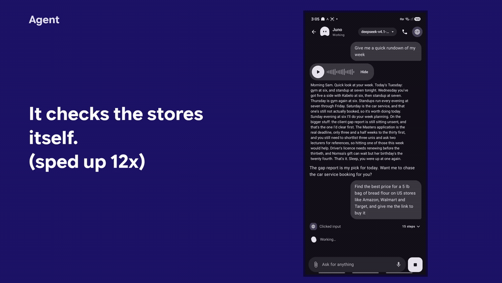
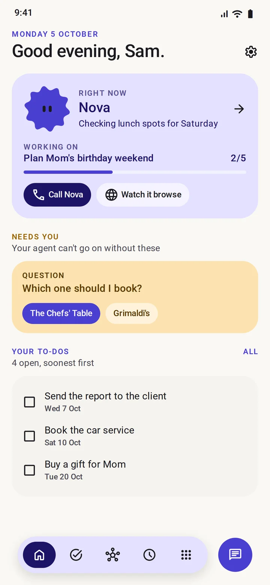
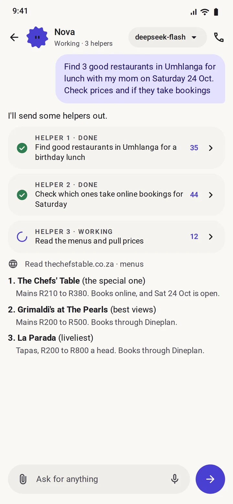
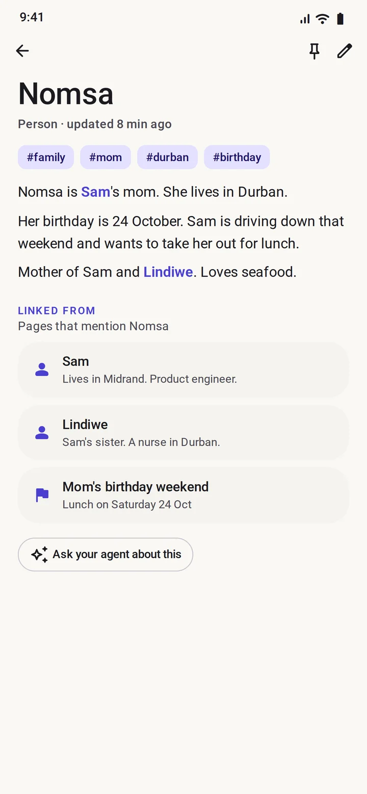
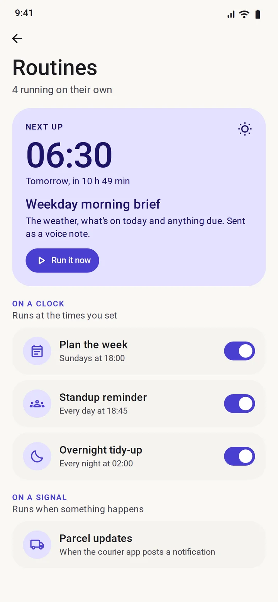

# Agent

An autonomous, always-on agent on your phone.
It has its own browser, keeps a wiki memory of everything it learns about you, and hands the heavy jobs to your own machines.
You bring the model. Paste an API key, or sign in with the ChatGPT or Claude plan you already pay for.

The best thing since Hermes.

[Get the APK](https://github.com/Past-da-king/agent/releases/latest) | [Watch it work](https://past-da-king.github.io/agent/) | [Build it from source](#build-from-source)

Free and open source, MIT. No account, no subscription, no server of ours.

## What it looks like

   

Home, chat, memory, routines. The two demo recordings are on the [project page](https://past-da-king.github.io/agent/).

## Install

It is not on the Play Store. You sideload the APK.

1. Open [Releases](https://github.com/Past-da-king/agent/releases/latest) and download `Agent-0.11.0.apk` on your phone.
2. Tap the file and allow the install when Android asks. That is the whole sideload.
3. Open Agent, give it a name, pick how it looks, then pick how to power it. See [Setup](#setup).
4. On a Samsung, Xiaomi or OnePlus phone, set the app's battery to **Unrestricted** under Settings, or Android will kill the browser and the routines while they work.

You need Android 10 or newer on an arm64 phone, which is every phone sold in the last few years. The APK is about 317 MB because the Node runtime, Codex and Claude Code ship inside it, so leave room for that and for its data.

## What it can actually do

**It goes and looks.** Its own browser runs in a foreground service, so it keeps working while you are in another app or the screen is off. When a site throws a captcha or a sign-in at it, it hands the page to you and carries on when you are done. Profiles keep Personal and Work apart, and helper agents can split a big job up.

**It remembers you.** Everything it learns gets a page in a wiki on the phone, linked to the pages around it. Read it, change it, pin it or delete it. Nothing is kept that you cannot see.

**It runs on a clock.** A routine can fire at a set time, on a new email, or the moment an app you chose sends a notification. It can watch a price for weeks and only speak up when it actually moves.

**It uses the accounts you have.** Apps connect through [Composio](https://composio.dev) with your own key: Gmail, Calendar, Drive, Slack and a few hundred more. It asks to connect one only when a job needs it, and the sign-in opens inside the app. You can hold several accounts per app, like two Outlooks or four Gmails.

**It hands heavy work to a real computer.** Any server or PC you can SSH into becomes a machine it can use. Run a command, start a long job that keeps going in the background, move files both ways. Looking around just runs. Anything that changes the machine shows you the exact command first.

**It answers in voice, and reads your files.** Voice notes in and out, live calls if you add a Gemini key, photos and documents in chat, including scanned PDFs read on the device.

**It tidies up overnight.** At 02:00, and only while charging and online, it sorts its memory, writes notes from the day and builds your morning screen.

**It waits for your yes.** Anything that spends money or sends something in your name stops at an approve button.

## What it is not

- Not a product. No account, no subscription, nobody to pay.
- Not on the Play Store, so nobody at Google has looked at it. Read the source, or build it yourself, if that matters to you.
- Not finished. It has mostly been tested on one Samsung phone, and live voice calls are the newest part.
- Not faultless. It is an agent with a browser and access to whatever you connect, so it will get things wrong. Read what you approve.
- Not for everyone yet. It expects you to be comfortable sideloading an APK and pasting a key.

## Permissions and privacy

Nothing is read until you allow it. Location, files, notifications and the rest are asked for at the moment a job needs them, and the app runs with all of them denied. The one most people want is notifications, and even then you pick the apps it may read, one at a time, and take it back whenever you like.

- Keys are stored on the phone in `EncryptedSharedPreferences`, locked by the Android Keystore.
- Memory, tasks, routines and chat live in a Room database on the phone.
- Traffic leaves the phone only to the model you picked, the sites the agent browses, Composio if you added a key, your voice provider if you added one, and the machines you added.
- Machine secrets stay encrypted on the phone and the agent only ever sees a machine's name. A machine is pinned the first time you connect, and refused if its identity changes later.

## Star it if you want it to exist

If an agent that lives on your phone and answers to you is something you want to keep existing, [give the repo a star](https://github.com/Past-da-king/agent). It is the only signal this project has, and it is what puts Agent in front of the next person looking for it.

## Setup

Onboarding walks you through this. In order:

1. **Name and style.** Name your agent, pick a colour and a face. The face becomes the app's icon.
2. **Power.** Choose one:

   | Option | What you need | Notes |
   |---|---|---|
   | API key | A key from DeepSeek, OpenRouter, Gemini, Claude, OpenAI or OpenCode (Zen or Go) | Runs in the app's own agent loop. Quickest to set up. |
   | Any OpenAI-compatible endpoint | Base URL, model name and a key | Hosted services, or your own server. See [Self-hosted servers](#self-hosted-servers-ollama-lm-studio-vllm). |
   | ChatGPT subscription | A ChatGPT account (the free tier worked in testing) | Runs Codex on the phone through the bundled runtime. Sign in inside the app. |
   | Claude subscription | Claude Pro or Max | Runs Claude Code on the phone through the bundled runtime. Read [Risks](#risks) first. |

   Once a key is checked you can pick the model, and switch from the chip at the top of the chat at any time.
3. **Connections, if you want them.** Paste your Composio API key under **Connections**, then connect the apps you use. The agent can also ask for one mid-job, and that sign-in opens inside the app's browser.
4. **Voice, if you want it.** Under **Settings, Voice**, add a Gemini, OpenAI or ElevenLabs key for spoken replies. A Gemini key also turns on live calls.
5. **Notifications, if you want them.** Choose which apps the agent may read. Nothing is read until you pick.

## Self-hosted servers (Ollama, LM Studio, vLLM)

Pick **Other (OpenAI-compatible)**, then enter the server's base URL, usually ending in `/v1`, the model name and a key. Any placeholder works if your server does not check keys.

- **HTTPS is the default and the way to do it.** Put the server behind a reverse proxy with a certificate such as Caddy or nginx, or use `tailscale serve` to get an `https://` address on your tailnet.
- **Plain HTTP on your LAN** (`http://192.168.1.20:8080/v1` and the like) is blocked unless you opt in. When the URL starts with `http://` you get a warning and a checkbox, *Allow unencrypted HTTP for this server*. Requests and your API key then travel in clear text, so only tick it on a network you trust. The opt-in is saved with that server and cleared when you switch provider.
- Built-in providers always use HTTPS.

## Machines, over SSH

Your phone is the remote, not the engine. Under **Connections, Machines** you can add any computer you can SSH into: a VPS, a university or work server, your own PC.

- **Sign in** with a password, a private key you already use, or a new key made on the phone. You paste its public half into `~/.ssh/authorized_keys` once, and no password is stored.
- **Through a gateway**, so a machine behind a login host can be reached as well.
- **Commands that change things ask first.** The card shows the exact command, unless you switch on *Run without asking* for that machine.
- **At home**, put the phone and the computer on the same [Tailscale](https://tailscale.com) network and use the computer's tailnet address. On Windows, turn on *OpenSSH Server* under Settings, Optional features, or run `sshd` inside WSL.

## Build from source

You need JDK 17, the Android SDK (compileSdk 37), and for the runtime pack `curl`, `ar`, `patchelf` and Node/npm.

```bash
git clone https://github.com/Past-da-king/agent
cd agent
# Downloads Termux's Node build, Codex and ripgrep and packs them as jniLibs plus assets,
# which are git-ignored. Only needed for the subscription paths. API keys work without it.
./tools/build-runtime-pack.sh
./gradlew assembleDebug
adb install -r app/build/outputs/apk/debug/app-debug.apk
```

Tests: `./gradlew testDebugUnitTest`, which runs the unit tests plus Robolectric and Roborazzi screenshots in light and dark.

## How it works, in short

- Kotlin and Jetpack Compose (Material 3 Expressive), Room, WorkManager.
- On the API key path, a provider-neutral agent loop in Kotlin that speaks both chat formats.
- On the subscription path, Node 24 (Termux's Android build) ships inside the APK as `lib*.so` files, because Android only lets an app execute files from its native library folder, and the Agent SDK runs on it. Codex and Claude Code ship the same way as their arm64 musl builds; Claude Code gets the musl loader as `libldmusl.so`, and a local proxy resolves DNS for both. The app's own tools are served to them over a local MCP server on `127.0.0.1` with a per-install token.
- The browser is an Android WebView hosted in a foreground service.

## Risks

- **Your own risk.** The agent can browse, fill in forms, read the notifications you allow and act in the apps you connect. Approvals guard payments and sends, so check what you approve.
- **The Claude subscription login is not officially sanctioned.** The option is there because it works. Using it is a call you make about your own account. A Claude API key is the safe way to use those models here.
- **Sideloaded.** It is not reviewed by Google.
- **Battery.** Background browsing and routines use battery. The overnight routine only runs while charging.
- **Early software.** Tested mainly on one Samsung phone.

## License

MIT. See [LICENSE](LICENSE).
